# Ashes 2063 — pixel-style 3D weapon models (work in progress)

Low-poly 3D models of the weapons from **Ashes 2063**, built from scratch in Blender with blocky,
pixelated textures and deliberately choppy, frame-by-frame (stop-motion) animations, so they sit
alongside the game's retro look. The long-term aim is to use them in **VR** (GZDoom VR), where
flat weapon sprites look out of place.

> ⚠️ **Disclaimer.** This is an unofficial, non-commercial fan project. It is **not** made by or
> affiliated with the creators of Ashes 2063, and it is **not** a playable mod yet: it is models and
> animations only. **No original game files, sprites, sounds or other assets are included.** Every
> model here was made from scratch, using the game only as a visual reference.
>
> **Ashes 2063 is free.** It is a standalone mod (it does not need Doom or any other game), and you
> can download it from its official page on ModDB:
> **https://www.moddb.com/mods/ashes-2063/downloads**
>
> ⚠️ **Caution.** Once this is used in VR it will be unfinished work and **may cause severe motion
> sickness and discomfort**. Take breaks and stop if you feel unwell.

## ▶️ Play it in VR — first release, v0.1.0 (2026-09-23)

**[Download from Releases](https://github.com/TefMeister/ashes-2063-weapons/releases/latest)** — four weapons as
3D models in your hands: the **revolver**, the **pistol** in a half-glove hand, the **shotgun** with gloved hands
and a real **two-handed grip**, and the **lantern** in your left hand, held by its handle.

**You need first:** the free Ashes 2063 standalone pack ([ModDB](https://www.moddb.com/mods/ashes-2063/downloads))
already playing in VR through GZDoomVR and SteamVR.
**Install:** unzip the download into your Ashes 2063 folder (the one holding `Resources`), then start
`Play Ashes 2063 VR - 3D Weapons.bat` with the headset on and SteamVR running. Nothing of your game or your VR
setup is overwritten; full instructions are in `3DWeapons/README.txt` inside the download.

The release carries its own copy of **GZDoomVR** (by hh79, GPL-3.0) with our changes, which let a mod see
your left hand and aim a long gun between your two hands. Those changes are in [`engine/`](engine/) and inside
the download as patches. From here on each weapon is improved one at a time.

## What's here

| Folder | Item | Files |
| --- | --- | --- |
| [`lantern/`](lantern/) | Lantern (makeshift fusion-battery lamp) | model + flicker/lightning animation, version history |
| [`handgun/`](handgun/) | 9mm handgun | model, shoot 1, reload, plus `_static` versions |
| [`revolver/`](revolver/) | .45 revolver | model, shoot 1, reload, plus `_static` versions (timed from the game) |
| [`jackhammer/`](jackhammer/) | Jackhammer | model, shoot 1, plus `_static` version |
| [`shotgun/`](shotgun/) | Pump-action shotgun | model, shoot 1, reload (dry) and reload (partial), plus `_static` versions — **and it runs in the game** ([`shotgun/gzdoom/`](shotgun/gzdoom/)) |
| [`crowbar/`](crowbar/) | Crowbar | model, shoot 1 (swing) |
| [`kit/`](kit/) | Python scripts that build every `.blend` above | |

Each weapon has **one Blender file per job**: the model on its own, and one file per animation. The
animation files link the model, so fixing a model updates all of its animations.

Every animation comes in **two versions**:
- the normal file, with the movement the game intends (kick, turning the gun to reload), and
- a **`_static`** file, where the weapon itself never moves and only its parts do (muzzle flash,
  slide, casing, magazine out and in). That is for anyone who later wants to add hands.

Details, measurements and open questions: [`NOTES.md`](NOTES.md) and [`lantern/NOTES.md`](lantern/NOTES.md).

## Progress

All pictures are **unlit on purpose**: no lights or reflections, just the flat colours the game will show.

Pictures of each big step are in each item's `progress/` folder, named by date.

| Item | Latest |
| --- | --- |
| Lantern | 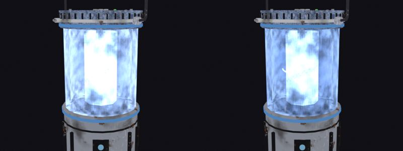 |
| Handgun | 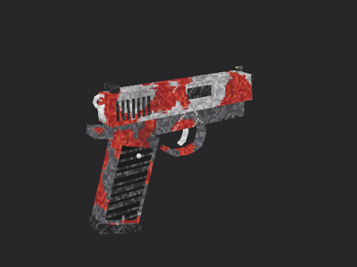 |
| Handgun reload | 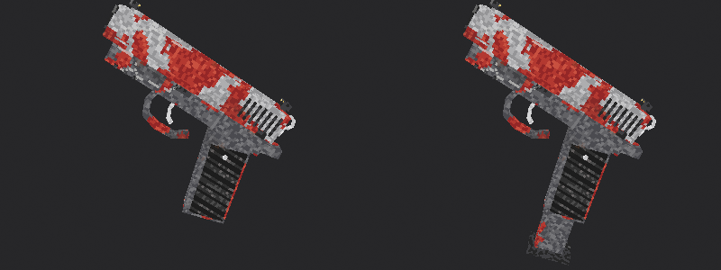 |
| Revolver | 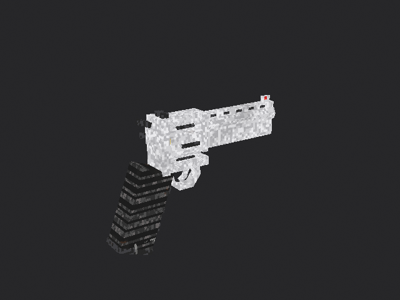 |
| Revolver reload | 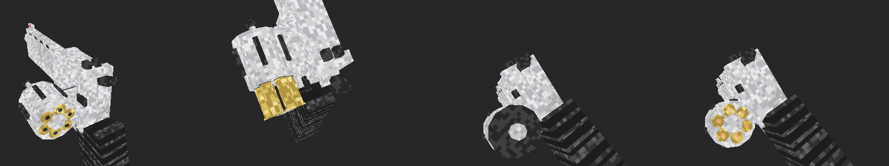 |
| Shotgun | 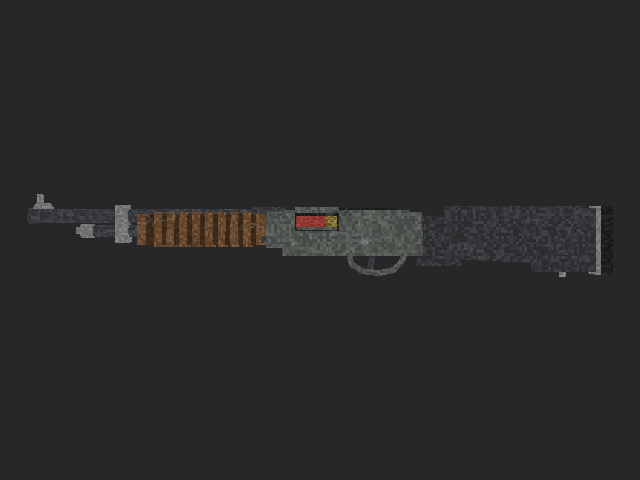 |
| Shotgun (port) | 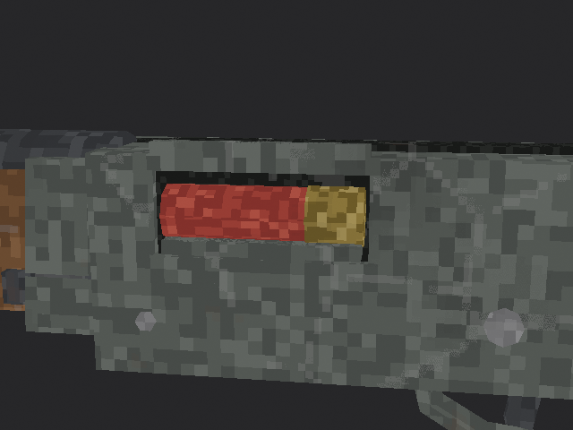 |
| Shotgun shot | 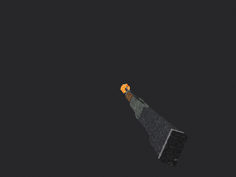 |
| Shotgun reload | 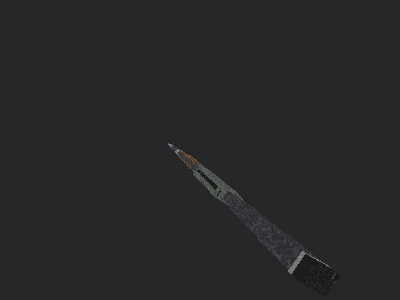 |
| Shotgun in the game | 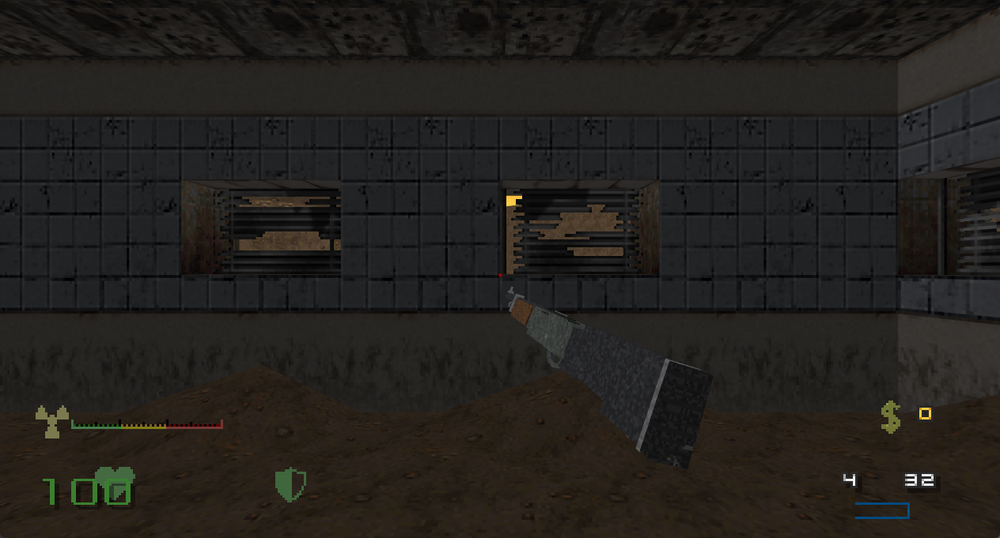 |
| Jackhammer | 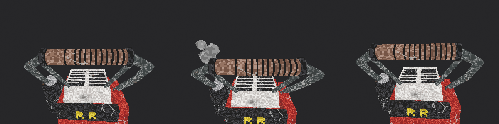 |
| Crowbar | 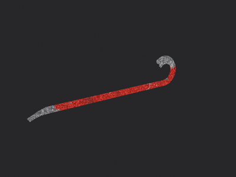 |

## Rebuilding

Blender 5.2. Each script rebuilds its file, for example (runs in the background, no window):

```
blender -b --factory-startup --python kit/run_background.py -- anim_handgun_reload.py static
```

Scripts currently use absolute paths under `C:\Users\TD3KX\ashes-2063-weapons`; change the paths at
the top of each script if you clone elsewhere.

## Credits

- **Ashes 2063** by Vostyok and contributors, the game these designs are based on.
- **Blender** (Blender Foundation), used for all modelling, animation and rendering.
- **GZDoom / GZDoom VR** and the Doom modding community, the engine these are meant for.
- Design direction, drawings and screenshots: Tefa. Modelling and scripting: made with Claude (Anthropic).

If you should be credited here and aren't, email **td3kxlvr@proton.me** and we'll fix it as soon as
possible. We honour correction and removal requests from rights holders.
